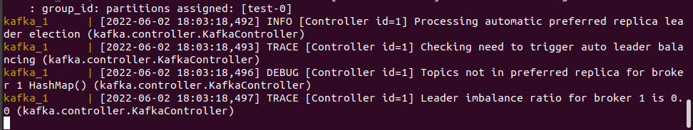

# Kafka İle Procuder-Consumer Uygulaması

Uygulama kısaca Apache Kafka ile iki uygulamanın haberleşmesini sağlamaktadır. Uygulama Java Spring Boot ile yazılmışıtr. Aşağıda uygulamayı ne şekilde çalıştırabileceğiniz açıkça gösterilmiştir.

### 1-) Uygulamanın Klonlanması

Dosyayı GitHub'tan bilgisayarınızdaki herhangi bir dizine klonlayınız. Bunun için aşağıdaki kodu kullanabilirsiniz.

```
git clone git@github.com:cemilbayhan/ApacheKafkaConsumer.git
```


###2-) Docker-Compose İle Uygulamanın Başlatılması
Klonladığınız projenin kök dizininde bir "docker-compose.yml" dosyası bulunmalıdır. Bu dosya ile uygulamayı çalıştırabiliriz. Bunun için, terminalde aşağıdaki komutu kullanın ve işlemin tamamlanmasını bekleyin:

```
docker-compose up
```



Bu komutu başarıyla çalıştırdıktan sonra, 80:80 port üzerinden gelen istekleri dinleyen bir uygulamanın başlatıldığını görürsünüz. Şimdi, bir HTTP POST isteği göndermek için curl kullanalım.
### 3-) Curl İle HTTP POST İsteği Gönderme

```
curl --location --request POST 'http://localhost:8080/send' \
--header 'test: aaaa' \
--header 'Content-Type: application/json' \
--data-raw '{
"title":"Example","description":"Example Description"
}'
```

Yukarıdaki komutu yeni bir terminal penceresine yapıştırın ve Enter tuşuna basın.


Curl ile yapılan POST isteği sonrasında, JSON formatındaki gönderilen mesajın, uygulamanın terminal çıktısında gözüktüğünü görebilirsiniz.

### 4-) Docker-Compose.yml Dosyası İle Uygulamanın Doğrudan Başlatılması

Aşağıdaki kod bloğunu "docker-compose.yml" adlı bir dosya içerisine kaydedin:

```
version: '3.3'
services:
  zookeeper:
    image: confluentinc/cp-zookeeper:latest
    environment:
      ZOOKEEPER_CLIENT_PORT: 2181
      ZOOKEEPER_TICK_TIME: 2000

  kafka:
    image: confluentinc/cp-kafka:latest
    ports:
      - "9092:9092"
    depends_on:
      - zookeeper
    environment:
      KAFKA_BROKER_ID: 1
      KAFKA_ZOOKEEPER_CONNECT: zookeeper:2181
      KAFKA_ADVERTISED_LISTENERS: PLAINTEXT://kafka:29092,PLAINTEXT_HOST://localhost:9092
      KAFKA_LISTENER_SECURITY_PROTOCOL_MAP: PLAINTEXT:PLAINTEXT,PLAINTEXT_HOST:PLAINTEXT
      KAFKA_INTER_BROKER_LISTENER_NAME: PLAINTEXT
      KAFKA_OFFSETS_TOPIC_REPLICATION_FACTOR: 1

  producer:
    image: cemilbayhan/producerkafka:1.0
    ports:
      - "8080:8080"
    depends_on:
      - kafka
    environment:
      SERVER_PORT: 8080
      SPRING_KAFKA_PRODUCER_BOOTSTRAP_SERVERS: kafka:29092
      SPRING_KAFKA_PRODUCER_KEY_SERIALIZER: org.apache.kafka.common.serialization.StringSerializer
      SPRING_KAFKA_PRODUCER_VALUE_SERIALIZER: org.apache.kafka.common.serialization.StringSerializer

  consumer:
    image: cemilbayhan/consumerkafka:1.0
    depends_on:
      - kafka
      - producer
    environment:
      SPRING_KAFKA_CONSUMER_BOOTSTRAP_SERVERS: kafka:29092
      SPRING_KAFKA_CONSUMER_AUTO_OFFSET_RESET: earliest
      SPRING_KAFKA_CONSUMER_GROUP_ID: test
      SPRING_KAFKA_CONSUMER_KEY_SERIALIZER: org.apache.kafka.common.serialization.StringSerializer
      SPRING_KAFKA_CONSUMER_VALUE_SERIALIZER: org.apache.kafka.common.serialization.StringSerializer
```

Bundan sonra yapmanız gereken bu dosyayı hangi dizine kaydettiyseniz 2. ve 3. adımları uygulayarak aynı sonuçları almak olacak.


